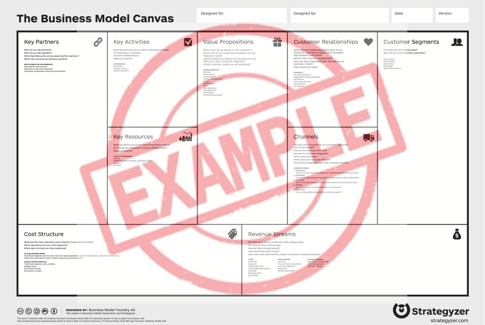

# Especificação do projeto

Pré-requisitos: <a href="01-Contexto.md"> Documentação de contexto</a>

Esta seção apresenta a definição do problema e a proposta de solução sob a perspectiva do usuário: personas, histórias de usuários, requisitos funcionais e não funcionais, regras de negócio, restrições e o tratamento de dados pessoais.

## Modelo de negócio (*Business Model Canvas*)

O *Business Model Canvas* (BMC) é uma ferramenta de planejamento estratégico que descreve, de forma visual e integrada, como uma organização cria, entrega e captura valor.

A seguir, apresenta-se um exemplo que deve ser adaptado pelo grupo de acordo com as características do projeto.

> **Links úteis**:
> - [Quadro de modelo de negócios](https://pt.wikipedia.org/wiki/Quadro_de_modelo_de_neg%C3%B3cios)
> - [Business Model Canvas: como construir seu modelo de negócio?](https://digital.sebraers.com.br/blog/estrategia/business-model-canvas-como-construir-seu-modelo-de-negocio/)

## Personas

As personas são pessoas reais da Divertindo a Mente, descritas a partir das respostas das entrevistas.

Nos documentos aparecem apenas o primeiro nome e a idade da pessoa entrevistada; nenhum dado que identifique uma criança é registrado (LGPD; sem dados de saúde e só descrições pedagógicas).

### Professoras

#### P1: Ieronildes (Nide), 44 anos, proprietária e professora principal (usuária operadora)

- Contexto: Dona da escolinha, onde trabalha há 2 anos. Atende os alunos de todas as séries até o 5º ano. Além de dar aula, cuida das matrículas e da conversa com as famílias.
- Rotina: Dia movimentado, com demanda bastante corrida. Acompanha os alunos nas atividades e tarefas escolares, tira dúvidas, ajuda nas matérias em que eles têm dificuldade e prepara atividades de reforço de acordo com a necessidade de cada um. Cada aluno tem um caderno próprio na escolinha, onde ela aplica atividades com base no que ele está estudando no colégio.
- Como registra hoje: Usa uma planilha no Drive só para o controle financeiro (mensalidades). Já tentou anotar aulas, tarefas e notas nela, mas parou por falta de tempo. Hoje o acompanhamento pedagógico não é registrado em lugar nenhum, e o retorno aos pais é feito de boca.
- Como identifica reforço: Aplica uma avaliação diagnóstica para encontrar as principais dificuldades do aluno e observa o desempenho dele nas atividades do dia a dia. Considera a escala de 0 a 10 e a média 6,0 dentro do esperado, "mas sempre queremos um 10".
- Frustrações: Uma informação já se perdeu: ela não foi avisada de um trabalho de História do 3º ano, de 10 pontos, e ele não foi registrado.
- O que as famílias perguntam: Pedem notícias com bastante frequência. Querem saber como está o desenvolvimento da criança, se ela está avançando na aprendizagem e se fez todas as tarefas.
- Objetivos: Ver, ao abrir o sistema, o desenvolvimento de cada aluno, as atividades e trabalhos pendentes, as notas, as matérias com mais dificuldade e o que precisa ser reforçado.
- Fala: "Eu queria abrir o sistema e já ver o desenvolvimento de cada aluno, as atividades e trabalhos pendentes, as notas, as matérias em que apresenta mais dificuldade e o que precisa ser reforçado."
- Tecnologia: Usa um computador com monitor LG e um celular Xiaomi.

#### P2: Shirlei, 49 anos, professora auxiliar (usuária operadora)

- Contexto: Trabalha na escolinha desde 2025. Atende apenas os alunos do 6º ano. As duas professoras dividem os alunos por série, e não se revezam com o mesmo aluno.
- Rotina: Ajuda nas atividades, nos trabalhos, nos estudos para as provas e nas matérias em que os alunos têm mais dificuldade.
- Como registra hoje: Já usou a planilha do reforço para anotar tarefas, trabalhos e provas, mas hoje ela serve só para o controle financeiro. O acompanhamento dos alunos não fica registrado.
- Como identifica reforço: Aplica atividades diagnósticas para identificar as dificuldades de cada aluno e observa o desempenho dele nas atividades do dia a dia.
- Frustrações: Às vezes informações se perdem, porque os próprios alunos não trazem ou não passam tudo sobre as tarefas, os trabalhos e as provas do colégio.
- O que as famílias perguntam: Como está o desenvolvimento do filho, se ele está evoluindo e quais dificuldades ainda tem.
- Objetivos: Ver tudo organizado sobre cada aluno (tarefas, trabalhos, provas, notas, dificuldades e o que precisa ser reforçado) e acompanhar a evolução de cada um de forma simples, para dar um retorno mais completo às famílias.
- Fala: "Eu queria abrir o sistema e já ver tudo organizado sobre cada aluno: as tarefas, os trabalhos, as provas, as notas, as dificuldades e o que precisa ser reforçado."

As duas têm o mesmo nível de acesso ao sistema; elas se diferenciam pelas séries que atendem e pelo uso, não pelas permissões.

### Responsáveis

A facilidade com tecnologia foi informada pela própria pessoa, numa escala de 1 a 5.

#### P3: Camila, 33 anos, mãe (usuária de consulta)

- Contexto: Mãe de um aluno do 2º ano. Pergunta todos os dias como o filho está.
- Tecnologia: 3 de 5.
- Quer acompanhar: tarefas, notas, faltas e dificuldades de aprendizagem.
- Fala: "Eu queria abrir o sistema e já saber como meu filho está, o que ele precisa melhorar e se está acompanhando bem as atividades."

#### P4: Fernanda, 44 anos, mãe de dois alunos (usuária de consulta)

- Contexto: Tem um filho no 2º ano e outro no 5º ano. Fica sabendo diariamente como eles estão, pelo que as professoras relatam.
- Tecnologia: 5 de 5.
- Quer acompanhar: tarefas e dificuldades.
- Fala: "Eu queria abrir o sistema e já saber como está o rendimento deles no reforço escolar, além do colégio."

#### P5: Juscely, 38 anos, mãe (usuária de consulta)

- Contexto: Mãe de uma aluna do 6º ano. Hoje acompanha pelo boletim do colégio, perguntando aos professores na reunião e olhando os cadernos da filha.
- Tecnologia: 4 de 5.
- Quer acompanhar: tarefas e dificuldades.
- Fala: "Eu queria abrir o sistema e já saber o que foi feito na última aula."

#### P6: Ana Beatriz, 27 anos, mãe (usuária de consulta)

- Contexto: Mãe de uma aluna da 3ª série. Pergunta à Nide como a filha está e tenta perguntar com frequência cada vez maior.
- Tecnologia: 4,5 de 5.
- Quer acompanhar: tarefas, notas e dificuldades.
- Fala: "Eu queria abrir o sistema e já saber qual é a atividade e o trabalho da semana."

#### O que as respostas dos responsáveis mostram

- Todas acompanham de perto, e a maioria pede notícias todos os dias.
- Tarefas e dificuldades aparecem nas 4 respostas; notas em 2; faltas em 1.
- A facilidade com tecnologia vai de 3 a 5, então o sistema precisa ser simples, mas ninguém se declarou com pouca familiaridade.
- Uma responsável tem dois filhos na escolinha, o que confirma a necessidade de ver mais de um aluno com o mesmo acesso.

## Histórias de usuários

Com base na análise das personas, foram identificadas as seguintes histórias de usuários:

| ID | História | Persona | Requisitos funcionais | Critério de aceitação |
|---|---|---|---|---|
| HU01 | Como professora, quero ver ao abrir o sistema um painel com o que está atrasado, o que vence nos próximos dias e quem precisa de reforço, para saber quem preciso olhar hoje. | Nide, Shirlei | Painel de pendências | O painel lista as seis categorias do painel de pendências, com nome do aluno e matéria; cada item leva ao histórico do aluno. |
| HU02 | Como professora, quero consultar o histórico completo de um aluno (aulas, tarefas, provas, trabalhos, notas, avaliações diagnósticas e sinalizações) filtrando por matéria e período, para preparar a conversa com a família. | Nide, Shirlei | Histórico do aluno | O histórico aparece em ordem cronológica e o filtro por matéria e período funciona. |
| HU03 | Como professora, quero registrar no computador a aula de um aluno com presença e matérias trabalhadas, para manter o histórico do que foi ensinado. | Nide, Shirlei | Registro de aula | O registro é simples: uma única tela com presença, matérias e conteúdos trabalhados, sem campos obrigatórios além desses. |
| HU04 | Como professora, quero ver o que foi trabalhado na última aula do aluno antes de começar, para dar continuidade ao conteúdo sem depender da memória. | Nide, Shirlei | Histórico do aluno | A última aula registrada aparece no topo do histórico, com professora e conteúdo. |
| HU05 | Como professora, quero registrar as tarefas passadas no reforço e as do colégio que o aluno ou a família me contam, com matéria e prazo, para não perder nenhuma. | Nide, Shirlei | Registro de tarefa | A tarefa só é salva com a origem (colégio ou reforço); nasce Pendente e passa a contar como atrasada no dia seguinte ao prazo. |
| HU06 | Como professora, quero cadastrar provas e trabalhos do colégio assim que fico sabendo da data, para preparar o aluno a tempo e lançar a nota depois. | Nide, Shirlei | Registro de prova ou trabalho, painel de pendências | A prova ou o trabalho aparece no painel nos 7 dias anteriores à data e pode ser salvo sem nota até ser realizado. |
| HU07 | Como professora, quero lançar a nota de cada prova do jeito que a escola do aluno avalia (pontos ou conceito), para medir o desempenho do aluno. | Nide, Shirlei | Registro de prova ou trabalho, cadastro de escolas | O sistema compara a nota com o esperado pela escola do aluno e marca a prova como dentro ou abaixo do esperado. |
| HU08 | Como professora, quero registrar o resultado da avaliação diagnóstica por matéria, para guardar as dificuldades encontradas e marcar o reforço a partir dele. | Nide, Shirlei | Avaliação diagnóstica, sinalização de reforço | A avaliação diagnóstica é salva sem nota, não entra na comparação com o esperado, aparece no histórico e permite marcar reforço manual com o motivo já preenchido. |
| HU09 | Como professora, quero que o sistema sinalize automaticamente a necessidade de reforço e também poder marcar ou desmarcar manualmente, para não depender só da memória. | Nide, Shirlei | Sinalização de reforço | A sinalização automática aparece quando uma prova da matéria fica abaixo do esperado pela escola do aluno; a marcação manual exige motivo e fica registrada no histórico. |
| HU10 | Como responsável, quero ver pelo celular um resumo do progresso do meu filho (notas, faltas, tarefas e dificuldades), para saber se preciso ajudar em casa. | Camila, Fernanda | Relatório de progresso | O resumo abre em tela de celular (360 px) sem rolagem horizontal e mostra tarefas pendentes no topo. |
| HU11 | Como responsável, quero ver o que foi feito na última aula e as tarefas, provas e trabalhos da semana, para acompanhar o dia a dia sem precisar perguntar. | Juscely, Ana Beatriz | Visão da semana | Logo após escolher o aluno, aparecem a data e os conteúdos da última aula registrada e os itens com prazo ou data na semana atual. |
| HU12 | Como responsável por mais de um aluno, quero ver todos com um único login e em linguagem simples, para acompanhar sem ajuda. | Fernanda | Cadastro e vínculo do responsável, relatório de progresso | Após o login aparece a lista dos alunos vinculados; a situação por matéria usa os rótulos "Em dia" e "Precisa de atenção". |
| HU13 | Como responsável, quero saber quais dados do meu filho são coletados e para quê, dar meu consentimento e poder revogá-lo pedindo à professora, para decidir com segurança. | Todos os responsáveis | Registro do consentimento, página de privacidade, pedido de revogação ou exclusão | O termo é exibido antes do primeiro acesso; o consentimento fica registrado com data e versão do termo; o pedido de revogação registrado pela professora bloqueia o acesso no mesmo dia. |
| HU14 | Como responsável, quero pedir à professora a exclusão dos dados do meu filho quando ele sair da escolinha, para que não fiquem guardados sem necessidade. | Todos os responsáveis | Pedido de revogação ou exclusão, eliminação dos dados | O acesso é bloqueado no mesmo dia do registro do pedido e os dados são eliminados em até 15 dias. |
| HU15 | Como responsável, quero avisar que meu filho fez a tarefa, para que a professora confira na próxima aula. | Todos os responsáveis | Aviso de tarefa feita | O aviso aparece no painel da professora e não altera o status da tarefa, que só a professora muda. |
| HU16 | Como responsável, quero ver apenas os dados dos meus próprios filhos, para ter certeza de que ninguém vê os dados deles no meu lugar e vice-versa. | Todos os responsáveis | Acesso só aos próprios filhos | Tentar abrir o endereço de um aluno não vinculado resulta em acesso negado (teste automatizado). |

## Requisitos

As tabelas a seguir apresentam os requisitos funcionais e não funcionais que detalham o escopo do projeto.

### Requisitos funcionais

| ID | Descrição | Prioridade | Origem |
|---|---|---|---|
| RF01 | Cadastrar, editar e consultar alunos (nome, data de nascimento, ano escolar, escola, matérias acompanhadas). | Alta | Nide |
| RF02 | Cadastrar o responsável e vinculá-lo aos alunos: cada aluno tem um único responsável com acesso, e um responsável pode ter mais de um aluno, com um único login. | Alta | Nide; vários filhos com um login |
| RF03 | Registrar o consentimento do responsável (data, forma de coleta e versão do termo). O aluno só fica ativo com consentimento registrado. | Alta | Consentimento e revogação; LGPD |
| RF04 | Cadastrar as matérias acompanhadas pela escolinha. | Alta | Nide |
| RF05 | Registrar aula: data, aluno, professora, presença (presente ou falta), matérias e conteúdos trabalhados e observação. | Alta | Registrar aula no computador |
| RF06 | Registrar tarefa vinculada a aluno e matéria, com origem (colégio ou reforço), descrição, data de atribuição e prazo. Só a professora registra. | Alta | Nide, Shirlei; registrar tarefas |
| RF07 | Atualizar o status da tarefa (Pendente, Entregue no prazo, Entregue com atraso, Não entregue), exclusivamente pela professora. | Alta | Registrar tarefas |
| RF08 | Permitir ao responsável sinalizar "meu filho fez a tarefa"; o aviso aparece no painel da professora e não altera o status. | Baixa | Avisar tarefa feita |
| RF09 | Registrar prova ou trabalho: aluno, matéria, origem (colégio ou reforço), data e descrição. Pode ser cadastrado antes da data, sem nota, e recebe a nota depois de realizado, conforme a escola do aluno: pontos obtidos sobre o valor da prova (escola por pontos) ou conceito (escola por conceito). Também pode ser cadastrado com a data já passada, com ou sem nota. Depois de 30 dias da data sem nota, a professora pode marcá-lo como sem nota. Junto da nota, a professora pode registrar um elogio, visível ao responsável. | Alta | Nide, Shirlei; provas e trabalhos com antecedência; lançar notas |
| RF10 | Sinalizar necessidade de reforço por matéria de forma automática, pela regra de reforço (prova abaixo do esperado pela escola do aluno), e manual (com motivo, inclusive a partir de uma avaliação diagnóstica). A automática sai sozinha e a manual só sai quando a professora desmarca. | Alta | Nide, Shirlei; avaliação diagnóstica; reforço automático e manual |
| RF11 | Exibir painel de pendências com seis categorias: tarefas atrasadas, tarefas que vencem em até 3 dias, provas e trabalhos dos próximos 7 dias, notas pendentes (provas e trabalhos com data passada e sem nota), alunos sinalizados para reforço e avisos do responsável. | Alta | Nide, Shirlei; painel ao abrir o sistema; provas e trabalhos com antecedência |
| RF12 | Exibir histórico por aluno em ordem cronológica (aulas, presença, tarefas, provas, trabalhos, avaliações diagnósticas e sinalizações), com filtro por matéria e período. | Alta | Histórico completo do aluno; ver a última aula |
| RF13 | Exibir relatório de progresso somente leitura com o conteúdo definido em "Conteúdo do relatório de progresso", abaixo. | Alta | Resumo do progresso no celular; vários filhos com um login |
| RF14 | Autenticar usuários por e-mail e senha; a professora pode redefinir a senha do responsável. | Alta | Todas as personas |
| RF15 | Autorizar o acesso por papel (professora ou responsável) e por vínculo: o responsável só acessa alunos vinculados a ele. | Alta | Ver só os próprios filhos; LGPD |
| RF16 | Encerrar matrícula: bloqueia na hora o acesso do responsável ao aluno e agenda a eliminação dos dados para 6 meses depois. | Alta | Nide; LGPD |
| RF17 | Eliminar ou anonimizar os dados de um aluno ao fim do prazo de guarda de 6 meses ou até 15 dias após o pedido do responsável. | Média | Pedir exclusão dos dados; LGPD |
| RF18 | Exibir página de privacidade em linguagem simples: dados coletados, finalidade, quem acessa, prazo de guarda e como pedir a revogação ou a exclusão. | Média | Consentimento e revogação; LGPD |
| RF19 | Registrar o pedido de revogação do consentimento ou de exclusão dos dados feito pelo responsável à professora, com data. O acesso é bloqueado no mesmo dia e a eliminação fica agendada para até 15 dias. | Média | Consentimento e revogação; pedir exclusão dos dados; LGPD |
| RF20 | Registrar avaliação diagnóstica: aluno, matéria, data e dificuldades observadas, sem nota e sem entrar na comparação com o esperado. | Alta | Nide, Shirlei; avaliação diagnóstica |
| RF21 | Exibir ao responsável a visão da semana: última aula (data e conteúdos trabalhados), tarefas pendentes ou com prazo na semana e provas e trabalhos com data na semana. | Alta | Juscely, Ana Beatriz; última aula e semana |
| RF22 | Cadastrar as escolas dos alunos com a forma de avaliação: por pontos, com a média exigida em porcentagem, ou por conceito, com os conceitos em ordem e o mínimo esperado. | Alta | Nide; alunos de escolas com regras diferentes |

#### Conteúdo do relatório de progresso

- **Identificação:** nome do aluno, ano escolar e período do relatório (mês ou bimestre, escolhido pela professora).
- **Frequência:** aulas com presença sobre aulas registradas no período, em número e porcentagem.
- **Desempenho por matéria:** notas das provas e trabalhos do período, indicando a origem (colégio ou reforço), elogio da professora, quando houver, indicação de dentro ou abaixo do esperado pela escola, e situação: "Em dia" ou "Precisa de atenção", conforme a regra de reforço.
- **Conteúdos trabalhados:** lista resumida dos conteúdos registrados nas aulas, por matéria.
- **Tarefas:** quantidade atribuída, entregues no prazo, entregues com atraso, não entregues e pendentes, além da taxa de entrega no prazo.
- **Observação da professora:** texto livre, de caráter pedagógico, visível para o responsável.

### Requisitos não funcionais

| ID | Categoria | Requisito (critério mensurável) | Prioridade |
|---|---|---|---|
| RNF01 | Usabilidade | O registro de aula e de tarefa é simples: uma única tela, com poucos campos e sem etapas extras, para caber na rotina corrida das professoras. | Alta |
| RNF02 | Responsividade | As telas das professoras são feitas para o navegador do computador (a partir de 1280 px de largura). As telas do responsável funcionam de 360 px a 1920 px de largura sem rolagem horizontal, com prioridade para o celular, e são testadas em celulares reais dos responsáveis. | Alta |
| RNF03 | Desempenho | 95% das requisições do painel, do histórico e do relatório respondem em até 2 segundos, com uma base de 30 alunos e 1 ano de registros. | Média |
| RNF04 | Disponibilidade | Sistema disponível em pelo menos 99% do horário de funcionamento da escolinha (de segunda a sexta, das 8h às 19h30), medido mensalmente por monitor externo (no máximo cerca de 2 horas e meia fora do ar por mês nesse horário). O serviço não pode hibernar nem ter partida a frio de mais de 5 segundos. | Média |
| RNF05 | Segurança | Senhas armazenadas com hash seguro e salt (nunca em texto puro), mínimo de 8 caracteres; limite de tentativas de login por usuário e por IP. | Alta |
| RNF06 | Segurança | Toda comunicação usa HTTPS (TLS). | Alta |
| RNF07 | Privacidade | A autorização por vínculo, em que o responsável só acessa os alunos vinculados a ele, é verificada em 100% dos endpoints que retornam dados de aluno, coberta por teste automatizado. | Alta |
| RNF08 | Auditoria | Acessos e alterações em dados de alunos ficam registrados (quem, quando, o quê) e são guardados por 6 meses. | Média |
| RNF09 | Confiabilidade | Backup automático diário do banco, com arquivo criptografado, guardado por 7 dias, com pelo menos 1 teste de restauração antes da entrega. | Média |
| RNF10 | Integridade | Banco relacional com chaves estrangeiras e restrições (ex.: nota entre 0 e 10, prazo não anterior à atribuição). | Alta |
| RNF11 | Acessibilidade | Texto com no mínimo 16 px nas telas do responsável no celular e contraste que atenda ao nível AA das WCAG 2.1. | Média |

## Regras de negócio

| ID | Regra | Situação |
|---|---|---|
| RN01 | A nota segue a forma de avaliação da escola do aluno: por pontos (pontos obtidos sobre o valor da prova, com uma casa decimal) ou por conceito (conceitos cadastrados para a escola). | Validada com a parceira |
| RN02 | Uma prova fica abaixo do esperado quando o aproveitamento (pontos obtidos sobre o valor da prova) fica abaixo da média exigida pela escola do aluno, ou quando o conceito fica abaixo do mínimo da escola. A divisão do ano (trimestre ou bimestre) não entra na conta. Escola sem regra cadastrada usa 60%. A avaliação diagnóstica não entra na comparação. | Decidida pela equipe |
| RN03 | Uma tarefa, do colégio ou do reforço, é considerada atrasada quando está com status Pendente e a data atual é posterior ao prazo. | Decidida pela equipe |
| RN04 | O aluno passa a "precisar de reforço" em uma matéria quando ocorrer pelo menos uma destas situações: (a) uma prova da matéria abaixo do esperado pela escola do aluno; (b) marcação manual da professora, por exemplo a partir de uma avaliação diagnóstica. Tarefas atrasadas ou não entregues não geram reforço. | Validada com a parceira |
| RN05 | A sinalização automática sai sozinha quando a próxima prova da matéria fica dentro do esperado. A sinalização manual só sai quando a professora desmarca. | Decidida pela equipe |
| RN06 | Somente a professora registra tarefas, provas e trabalhos e altera o status da tarefa. Os itens do colégio são registrados por ela quando o aluno ou a família avisam. O status registra a conferência feita pela professora, e não uma declaração: ele alimenta o painel e o relatório, então precisa ter uma única fonte confiável. O responsável pode avisar que a tarefa foi feita (aviso de tarefa feita), e a professora confirma. | Decidida pela equipe |
| RN07 | O responsável só acessa dados de alunos com vínculo ativo com ele. A verificação é feita no servidor em toda requisição, e não apenas escondendo itens na tela. | Obrigatória (LGPD) |
| RN08 | O cadastro do aluno só fica ativo depois que o consentimento de pelo menos um dos pais ou responsável legal for registrado. | Obrigatória (LGPD, art. 14, §1º) |
| RN09 | Ao encerrar a matrícula, o acesso do responsável é bloqueado imediatamente e os dados do aluno são eliminados após 6 meses (prazo para eventual retorno ou relatório final). Estatísticas sem identificação podem ser mantidas. | Decidida pela equipe |
| RN10 | Pedido de revogação do consentimento ou de exclusão feito pelo responsável à professora, que o registra no sistema: acesso bloqueado no mesmo dia e dados eliminados em até 15 dias. | Decidida pela equipe |
| RN11 | As duas professoras têm o mesmo nível de acesso (decisão da parceira). A Nide e a Shirlei se diferenciam pelas séries que atendem, não pelas permissões. | Decidida pela parceira |
| RN12 | Não são registrados diagnósticos médicos ou laudos (dados de saúde são dados sensíveis). As dificuldades são descritas apenas em termos pedagógicos. | Decidida pela equipe (minimização) |
| RN13 | Cada aluno tem um único responsável com acesso ao sistema. Um responsável pode estar vinculado a mais de um aluno, com um único login. | Decidida pela equipe |
| RN14 | Uma prova ou um trabalho com data passada e sem nota fica como nota pendente a partir do dia seguinte à data. Depois de 30 dias da data, a professora pode marcá-lo como sem nota: ele sai do painel, continua no histórico e não entra na comparação com o esperado. | Decidida pela equipe |
| RN15 | Quando o sistema sinaliza reforço automático numa matéria, a professora procura entender o motivo, conversa com os pais e passa atividades de reforço daquela matéria, registradas como tarefas de origem reforço, para que o responsável as veja na semana do filho. | Decidida pela equipe |

## Restrições

O projeto está restrito aos itens apresentados na tabela a seguir.

| ID | Tipo | Restrição |
|---|---|---|
| R01 | Legal | O tratamento de dados de crianças e adolescentes deve seguir a LGPD (Lei 13.709/2018), em especial o art. 14: melhor interesse da criança, consentimento específico e destacado de pelo menos um dos pais ou responsável legal, e informação pública e simples sobre os dados coletados. |
| R02 | Custo | A parceira não tem orçamento para software: a solução deve ter custo mensal zero, durante e depois da disciplina. Qualquer serviço pago só pode ser adotado com aprovação prévia da proprietária. |
| R03 | Equipamentos | O sistema roda no navegador, sem instalação, nos equipamentos que já existem. As professoras usam o computador da escolinha (Windows 10 ou superior). Os responsáveis usam o próprio celular (Android 10 ou superior ou iOS 15 ou superior), com conexão móvel 4G. Em todos os casos, nas duas versões mais recentes de Chrome, Edge e Safari. Nenhum equipamento novo será comprado. |
| R04 | Tecnologia | A disciplina exige sistema web com banco de dados relacional. |
| R05 | Prazo | O desenvolvimento está limitado ao cronograma da disciplina (semestre 2026). |
| R06 | Manutenção | A equipe não garante suporte depois da disciplina; por isso o sistema deve ser simples de operar e entregue com um guia de uso para as professoras. |

### Fora do escopo

- Módulo financeiro (mensalidades, pagamentos).
- Envio automático de mensagens por e-mail ou WhatsApp (possível trabalho futuro).
- Várias unidades ou escolas no mesmo sistema (multi-unidade).
- Acesso dos próprios alunos ao sistema.
- Mais de um responsável com acesso ao mesmo aluno.
- Registro de tarefas, provas e trabalhos pelo responsável (só a professora registra).

## Tratamento de dados (LGPD)

- **Papéis.** A Divertindo a Mente, representada pela proprietária, é a controladora dos dados. Os provedores de hospedagem, ainda a definir, atuarão como operadores. Durante o desenvolvimento, a equipe usará apenas dados fictícios; dados reais só entram no sistema depois da implantação e do consentimento.
- **Melhor interesse da criança (art. 14, caput).** Os dados são usados exclusivamente para o acompanhamento pedagógico do próprio aluno. Não há uso para publicidade, ranking entre alunos ou compartilhamento com terceiros.
- **Base legal e consentimento (art. 14, §1º e §5º).** O grupo adota o consentimento específico e destacado de pelo menos um dos pais ou responsável legal, coletado no cadastro por termo assinado ou por aceite no primeiro acesso, e registrado no sistema com data e versão do termo (registro do consentimento). O aluno só fica ativo depois desse registro. A ANPD admite outras bases legais para dados de crianças (Enunciado CD/ANPD nº 1/2023), mas o consentimento é o caminho mais simples e transparente para este caso.
- **Minimização.** Não coletamos CPF, endereço, fotos ou diagnósticos de saúde dos alunos; as dificuldades são descritas só em termos pedagógicos.
- **Autorização por vínculo.** Controle por papel não basta: o responsável só vê os alunos vinculados a ele, com checagem no servidor em toda requisição, coberta por teste automatizado. Tentativas de acessar outro aluno são negadas e ficam no registro de acessos, guardado por 6 meses.
- **Transparência (art. 14, §2º e §6º).** Página de privacidade em linguagem simples, dizendo quais dados são coletados, para quê, quem acessa, por quanto tempo e como pedir a revogação ou a exclusão (página de privacidade).
- **Encerramento e eliminação (arts. 15, 16 e 18).** Ao encerrar a matrícula, o acesso do responsável é bloqueado na hora e os dados são eliminados após 6 meses. A revogação do consentimento ou a exclusão é pedida à professora, que registra o pedido no sistema (pedido de revogação ou exclusão); o acesso é bloqueado no mesmo dia e os dados são eliminados em até 15 dias. Podem ser mantidas apenas estatísticas anonimizadas (art. 16, IV).
- **ECA Digital (Lei 15.211/2025).** Em vigor desde março de 2026, a lei trata de produtos digitais voltados a crianças ou com acesso provável por elas. Como os alunos não são usuários do Acompanha e o sistema não é direcionado a eles, o grupo entende que ela não se aplica diretamente; ainda assim, as práticas acima seguem a mesma linha de proteção.
